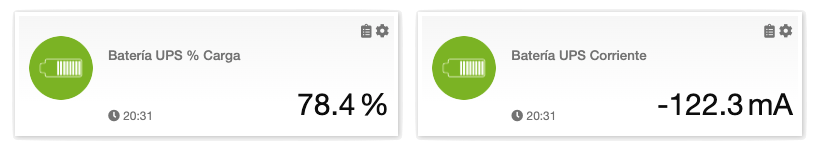

# UPS battery measures updater for Z-Way devices

## UPS HAT
Waveshare UPS HAT (B) For Raspberry Pi, 5V Uninterruptible Power Supply (UPS)

- Designed for Raspberry Pi series, compatible with Raspberry Pi 3 / 3B+ / 4B.
- 2S 18650 LiPo batteries, 7.4v nominal, 8.4v full charge.
- I2C/SMbus interface to monitoring the batteries voltage, current, power, and remaining capacity in real-time.
- Protection circuits for overcharge/discharge protection, over current protection, short circuit protection, and reverse protection.

See Waveshare wiki https://www.waveshare.com/wiki/UPS_HAT_(B)

## Z-Way devices

Requires two Z-Way "**Virtual Device (JavaScript)**", one for UPS battery current and one for charge percentage.



Z-Way server from [Z-Wave.me](https://z-wave.me/)

## Monitor
Python script `ups_monitor.py` gets continuous measures of UPS battery current and charge percentage to averaging them, and update it Z-Way devices every 10 seconds.

It must be edit to configure:
- Z-Way server host or ip, by default: `localhost`
- Z-Way server tcp port, by default: `8083`
- Z-Way server user and password or bearer token
- Z-Way virtual device for UPS battery current mA
- Z-Way virtual device for UPS battery charge percentage
  
It runs in python2 and python3, and requires `requests` and `smbus` modules.

### Install
```
pi@raspberrypi:/home/pi $ git clone https://github.com/latchdevel/zwayups.git
pi@raspberrypi:/home/pi $ cd zwayups
pi@raspberrypi:/home/pi/zwayups $ pip install -r requirements.txt
```

Raspberry Pi linux kernel must be enable I2C/SMBus hardware interface. 
It can be configured by `raspi-config` or manual edit of `/boot/config.txt` to set `dtparam=i2c_arm=on`.
After reboot i2c kernel modules are loaded.
```
pi@raspberrypi:/home $ lsmod |grep i2c
i2c_bcm2835            16384  0
i2c_dev                20480  0
```
### Running
```
pi@raspberrypi:/home/pi/zwayups $ ./ups_monitor.py
Waveshare UPS HAT (B) Monitor
Instant battery current=-192mA charge=94.3%
Updating Z-Way devices every 10 seconds
```

## Manual update 
Python script `ups_get.py` gets instant measures of battery current and charge percentage in JSON format.

```
pi@raspberrypi:/home/pi/zwayups $ ./ups_get.py
{"current":-19,"charge":93.0}
```
- Negative current value when battery discharging to power the Raspberry Pi.
- Positive current value when battery charging from external power.

It can be used to manual update of Z-Way Virtual Device. Code to get value:
```js
JSON.parse(system("/home/pi/zwayups/ups_get.py")[1])["current"]
```

Must be add `/home/pi/zwayups/ups_get.py` to Z-Way config file: `/opt/z-way-server/automation/.syscommands`

# License
Copyright (c) 2022 Jorge Rivera. All right reserved.

License GNU Lesser General Public License v3.0.

This library is free software; you can redistribute it and/or
modify it under the terms of the GNU Lesser General Public
License as published by the Free Software Foundation; either
version 3 of the License, or (at your option) any later version.

This library is distributed in the hope that it will be useful,
but WITHOUT ANY WARRANTY; without even the implied warranty of
MERCHANTABILITY or FITNESS FOR A PARTICULAR PURPOSE.  See the GNU
Lesser General Public License for more details.

You should have received a copy of the GNU Lesser General Public License 
along with this library; if not, write to the Free Software Foundation, 
Inc., 51 Franklin St, Fifth Floor, Boston, MA  02110-1301, USA.

See the [LICENSE](LICENSE.txt) file for license rights and limitations (lgpl-3.0).